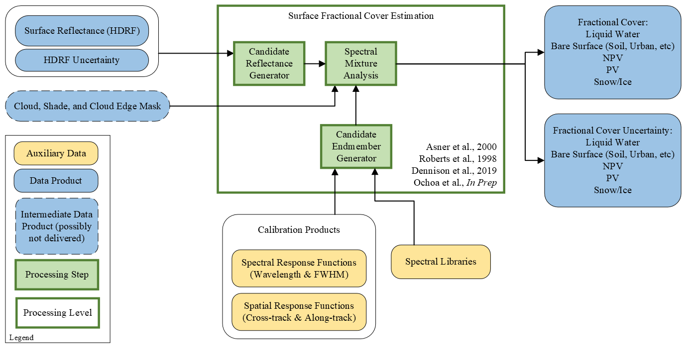

# **SBG VSWIR Fractional Cover – Algorithm Theoretical Basis Document (ATBD)** 

**P.G. Brodrick**1

1Jet Propulsion Laboratory, California Institute of Technology

Corresponding author: Philip G. Brodrick (philip.g.brodrick@jpl.nasa.gov)

**Key Points:**

- Fractional cover algorithms for SBG VSWIR

**Version:** 1.0

**Release Date:** TBD

**DOI:** TBD

# Abstract

# Plain Language Summary

## Keywords: snow fractional cover, snow grain size, snow albedo

# 1 Version Description

This is Version 0.0 of the SBG VSWIR Fractional Cover algoirthms.

# 2 Introduction

# 3 Context/Background

## 3.1 Historical Perspective

The SBG VSWIR Fractional Cover algorithm will build off a long heritage of retrievals, utilizing and improving on algorithms established for use with AVIRIS, AVIRIS-NG, and especially EMIT.

## 3.2 Additional Information

# 4 Algorithm Description

**Figure 1.** _Layout of possible fractional cover workflow._

## 4.1 Fractional Cover Algorithm

### 4.1.1 Scientific theory

### 4.1.1.1 Scientific theory assumptions

### 4.1.2 Mathematical theory

### 4.2.1.1 Scientific theory assumptions

## 4.3 Algorithm Input Variables

Inputs to the SBG-VSWIR fractional cover algorithm will come from the L2A Reflectance product.
The core inputs are:

- **Surface Reflectance** The hemispherical-directional reflectance factor, or HDRF, except over water surfaces, where it is assumed to be the water leaving reflectance.
- **Surface Reflectance Uncertainty**:  The model-based estimate of the posterior uncertainty covariance from the reflectance

## 4.4 Algorithm Output Variables

- **Surface Fractional Cover**: The proportion of each pixel that is represented by the target class.  There will be 8 classes:
-- Photosynthetic Vegetation
-- Non-photosynthetic Vegetation
-- Bare Surface
-- Water
-- Snow
-- Ice
-- Char
-- Cloud

- **Surface Fractional Cover Uncertainty**: The model-predicted uncertainty in the fraction of each of the classes noted above, taking into account the uncertainty of the surface reflectance as well as uncertainties within the fractional cover model.

# 5 Algorithm Usage Constraints

# 6 Performance Assessment

## 6.1 Validation Methods

## 6.2 Uncertainties

## 6.3 Validation Errors

# 7 Algorithm Implementation

## 7.1 Algorithm Availability

## 7.2 Input Data Access

## 7.3 Output Data Access

## 7.4 Important Related URLs

# 8 Significance Discussion

# 9 Open Research

# 10 Acknowledgements

# 11 Contact Details

# References
